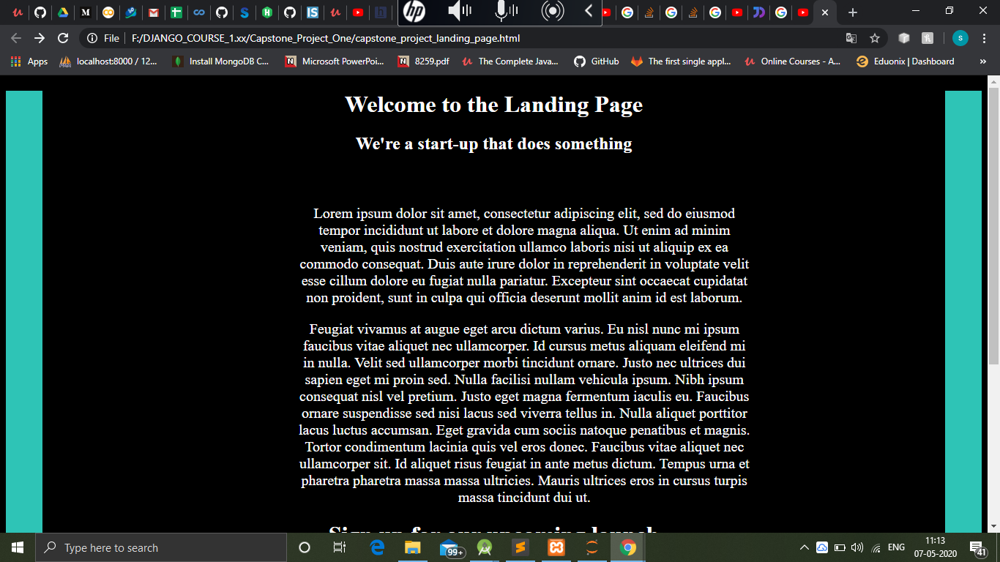
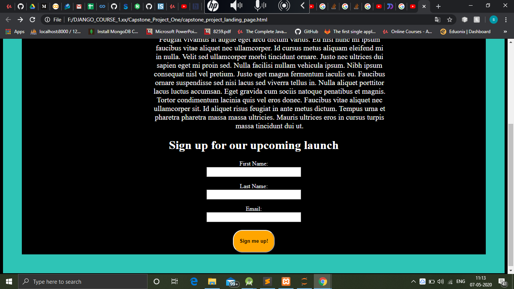
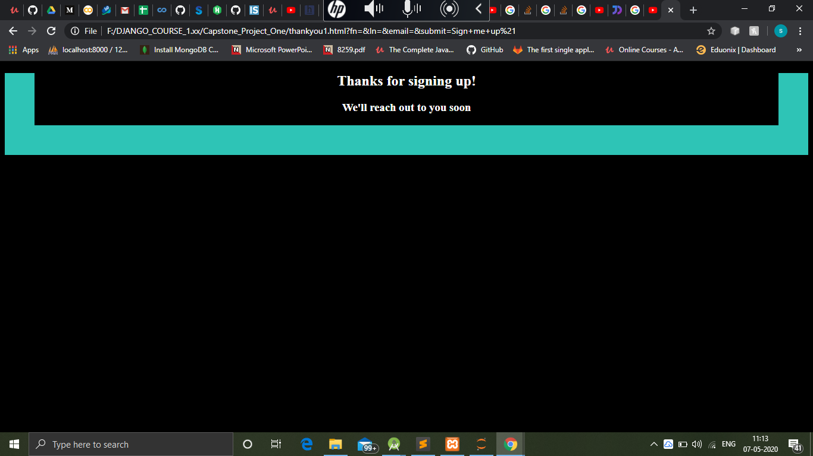

# HTML-CSS-project

A basic project in which I designed a landing page and thankyou page for educational institute using HTML and CSS.
It covered box model of css and other concepts like forms in html.

Technology Stack 

=> HTML

=>CSS